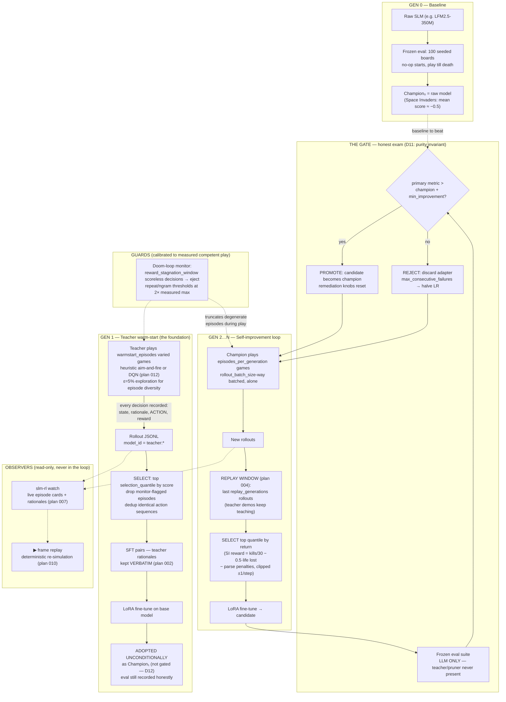

# The generation pipeline, 0 → 1

How a raw small language model becomes a self-improving game player.
This is the operator's mental model of one `slm-rl evolve` run; the
authoritative details live in DECISIONS.md (D-numbers), HYBRID_RL.md
(teacher seams), and ARCHITECTURE.md (layers). Diagram state: 2026-07-11,
Space Invaders era (plans 001–010, 012); Mastermind follows the same shape
with GRPO in place of reject_sft and the exact solver in place of the
heuristic/DQN teacher.

## The narrative in one pass

1. **Gen 0** measures the raw model honestly on the frozen suite. It is
   usually terrible; that is the point of a baseline.
2. **Gen 1** is the classical teacher demonstrating: many genuinely
   different games (seeded no-op starts; ε-exploration), played to natural
   game-over, every move narrated in language. The top quantile is
   distilled into the model by SFT — rationales verbatim, so the
   *procedure* is in the training tokens, not just the answers. The result
   is adopted as the champion without a gate: SFT is initialization, not a
   competitor (D12 — a warm start twice lost a noisy exam it should never
   have had to sit).
3. **Gens 2+** are the actual RL loop: the champion plays alone, its best
   games (plus teacher demos still inside the replay window) become the
   next lesson, and the gate — always solo, always the same frozen boards —
   decides promotion by a ~2σ margin. Rejections trigger bounded
   remediation (LR halving), promotions reset it.
4. Two subsystems deliberately never touch learning: the **monitor** only
   stops wasted episodes (its thresholds are calibrated so competent play
   is never flagged — every number in the game yaml cites its measurement),
   and the **viewers** only read the record stream.

## Hard-won rules encoded in this shape (each cost a broken run)

- **Gate purity**: assistance during training is fine; assistance during
  the exam is fraud. Promotion always means the model itself improved.
- **Teacher diversity**: a deterministic teacher on a (near-)seed-invariant
  env demonstrates ONE game a thousand times; the dedup quota then deletes
  the dataset. Exploration is not optional (plan 009, revision 1).
- **Truncation eats signal from the top**: turn caps and stagnation windows
  tuned for weak play will cut your *best* episodes first — exactly the
  ones quantile selection needs (max_turns 80→400→2000; window 40→240).
- **Eval seeds must vary the world**: if every seed replays the same board,
  the eval measures recall, not play (no-op starts; the score:155 wall).
- **Comparability boundaries**: any change to prompts, rewards, episode
  physics, or eval protocol starts a new run-id. Numbers across a boundary
  are different benchmarks that happen to share a name.
